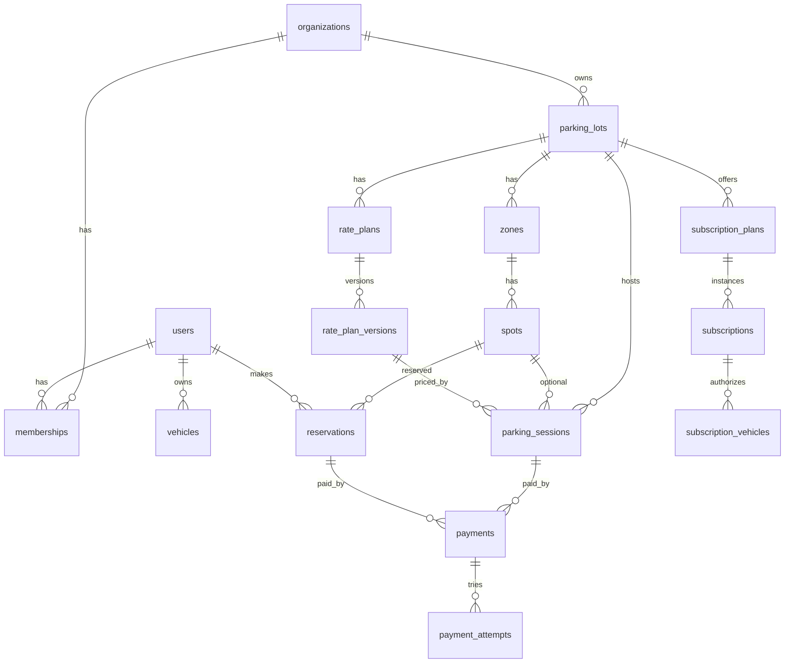

# Modelo de Dados — Neulander Parking

> PostgreSQL 16 + PostGIS + `btree_gist` + `pg_trgm` · ORM: Drizzle · Dono: `database-engineer`

## Convenções

- PK `id uuid` (UUID v7, gerado na aplicação → ordenável por tempo).
- `created_at`, `updated_at timestamptz not null default now()` em todas as tabelas mutáveis.
- Dinheiro: `*_cents integer not null` + `currency char(3) default 'BRL'`.
- Enums como `text` + `CHECK` (mais fácil de migrar que `CREATE TYPE`), espelhados em `packages/contracts`.
- Tabelas pertencem a **um** módulo; o schema Drizzle fica em `modules/<ctx>/infra/schema.ts`.
- FK entre módulos é permitida no banco (integridade), mas o código de um módulo não faz JOIN em tabela de outro — usa o serviço público.
- Soft delete apenas onde há exigência (lots, spots): `archived_at timestamptz`.

## ERD



## Tabelas por módulo

### identity
| Tabela | Colunas principais | Índices / restrições |
|---|---|---|
| `users` | id, email (citext), password_hash, name, phone, cpf_encrypted, role_global (`driver`\|`platform_admin`\|null), email_verified_at, deleted_at | unique(email) |
| `organizations` | id, name, legal_name, cnpj, status (`active`\|`suspended`) | unique(cnpj) |
| `memberships` | id, organization_id, user_id, role (`owner`\|`manager`\|`operator`), parking_lot_ids uuid[] (escopo do operador; vazio = todos) | unique(organization_id, user_id) |
| `refresh_tokens` | id, user_id, token_hash, family_id, expires_at, revoked_at, replaced_by | index(user_id), unique(token_hash) |

### facilities
| Tabela | Colunas principais | Índices / restrições |
|---|---|---|
| `parking_lots` | id, organization_id, name, slug, address jsonb, location geography(Point,4326), timezone, opening_hours jsonb, total_capacity, status (`draft`\|`published`\|`closed`), amenities text[], archived_at | GiST(location), unique(organization_id, slug) |
| `zones` | id, parking_lot_id, name, level, kind (`general`\|`pcd`\|`elderly`\|`ev`\|`moto`\|`vip`) | |
| `spots` | id, zone_id, parking_lot_id, code, kind, status (`free`\|`occupied`\|`reserved`\|`blocked`), reservable bool, archived_at | unique(parking_lot_id, code), index(parking_lot_id, status) |

### pricing
| Tabela | Colunas principais | Índices / restrições |
|---|---|---|
| `rate_plans` | id, parking_lot_id, name, applies_to (`rotating`\|`reservation`), active_version_id | |
| `rate_plan_versions` | id, rate_plan_id, version int, rules jsonb (validado por Zod `RatePlanRules`), valid_from, created_by | unique(rate_plan_id, version) — **imutável** |

### sessions
| Tabela | Colunas principais | Índices / restrições |
|---|---|---|
| `parking_sessions` | id, organization_id, parking_lot_id, spot_id?, plate_normalized, vehicle_id?, driver_user_id?, reservation_id?, subscription_id?, rate_plan_version_id, status, entry_at, exit_deadline_at?, exit_at?, amount_due_cents?, ticket_code (curto, p/ QR), entry_channel (`operator`\|`app`\|`gate`\|`lpr`), opened_by, closed_by | **partial unique(parking_lot_id, plate_normalized) WHERE status IN ('open','awaiting_payment','paid')** — impede dupla entrada; index(parking_lot_id, status); trigram(plate_normalized); unique(ticket_code) |

### reservations
| Tabela | Colunas principais | Índices / restrições |
|---|---|---|
| `reservations` | id, parking_lot_id, spot_id, driver_user_id, plate_normalized, period tstzrange, status, price_cents, hold_expires_at, checked_in_session_id? | **EXCLUDE USING gist (spot_id WITH =, period WITH &&) WHERE (status IN ('pending_payment','confirmed','checked_in'))** |

### payments
| Tabela | Colunas principais | Índices / restrições |
|---|---|---|
| `payments` | id, organization_id, payable_type (`session`\|`reservation`\|`subscription_invoice`), payable_id, amount_cents, currency, method (`pix`\|`card`\|`cash`), provider, provider_payment_id, status, idempotency_key, paid_at, refunded_cents | unique(idempotency_key), unique(provider, provider_payment_id), index(payable_type, payable_id) |
| `payment_attempts` | id, payment_id, request jsonb (sanitizado), response jsonb, status, created_at | |
| `webhook_events` | id, provider, external_event_id, payload jsonb, received_at, processed_at, error | unique(provider, external_event_id) |

### subscriptions (mensalistas)
| Tabela | Colunas principais |
|---|---|
| `subscription_plans` | id, parking_lot_id, name, price_cents, billing_day, rules jsonb (horários permitidos, vaga fixa?) |
| `subscriptions` | id, plan_id, customer_user_id?, customer_name, customer_document_encrypted, status (`active`\|`past_due`\|`cancelled`), current_period_end, fixed_spot_id? |
| `subscription_vehicles` | id, subscription_id, plate_normalized — unique(subscription_id, plate_normalized) |
| `subscription_invoices` | id, subscription_id, period, amount_cents, status, due_date, payment_id? |

### shared / plataforma
| Tabela | Uso |
|---|---|
| `outbox_events` | id, aggregate_type, aggregate_id, type, payload jsonb, occurred_at, published_at? — index(published_at) WHERE published_at IS NULL |
| `idempotency_keys` | key, scope (user/device), request_hash, response_status, response_body jsonb, expires_at — PK(scope, key) |
| `audit_logs` | id, organization_id, actor_user_id, action, target_type, target_id, diff jsonb, ip, created_at |
| `notifications` | id, user_id, channel, template, payload jsonb, status, sent_at |
| `vehicles` | id, user_id, plate_normalized, nickname, kind — unique(user_id, plate_normalized) |
| `gate_devices` *(pós-MVP)* | id, parking_lot_id, kind (`entry`\|`exit`\|`lpr_camera`), api_key_hash, last_seen_at |

## Formato de `rate_plan_versions.rules` (exemplo)

```json
{
  "graceMinutes": 10,
  "first": { "minutes": 60, "priceCents": 1200 },
  "additional": { "minutes": 30, "priceCents": 400 },
  "dailyCapCents": 6000,
  "overnight": { "from": "22:00", "to": "06:00", "flatCents": 3000 },
  "overrides": [
    { "days": ["sat", "sun"], "first": { "minutes": 60, "priceCents": 800 } }
  ],
  "lostTicketFeeCents": 5000
}
```

## Particionamento e retenção (Fase 10+)

- `parking_sessions`, `payments`, `audit_logs`: particionamento declarativo por mês (`entry_at`/`created_at`) quando > 10 M linhas.
- `outbox_events` publicados: purge após 7 dias. `idempotency_keys`: TTL 24 h (job diário).
- Anonimização LGPD: job que remove vínculo `driver_user_id` e mascara placa em sessões > 5 anos.
