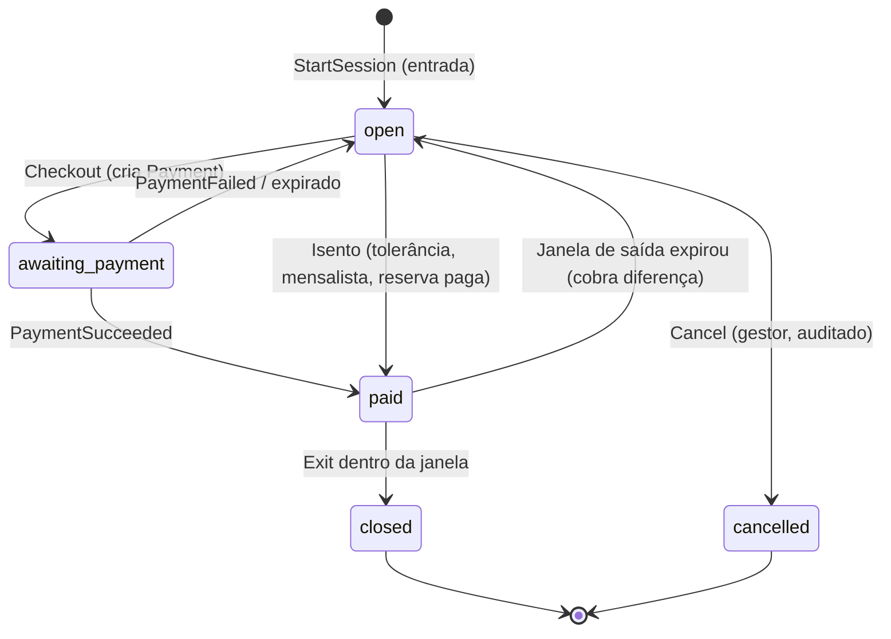
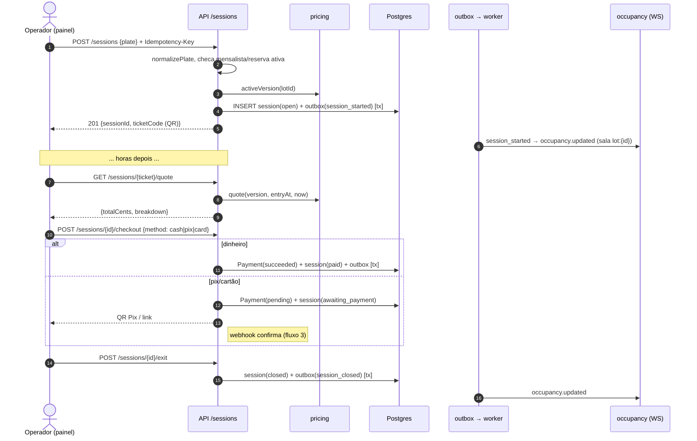
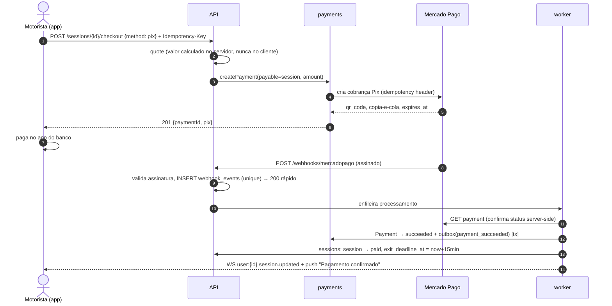
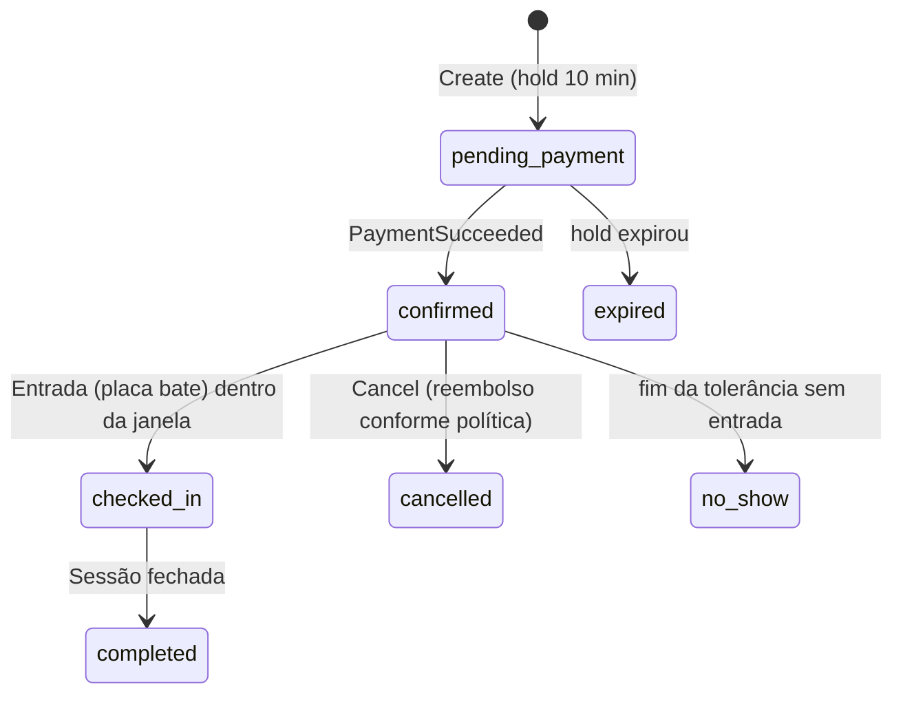
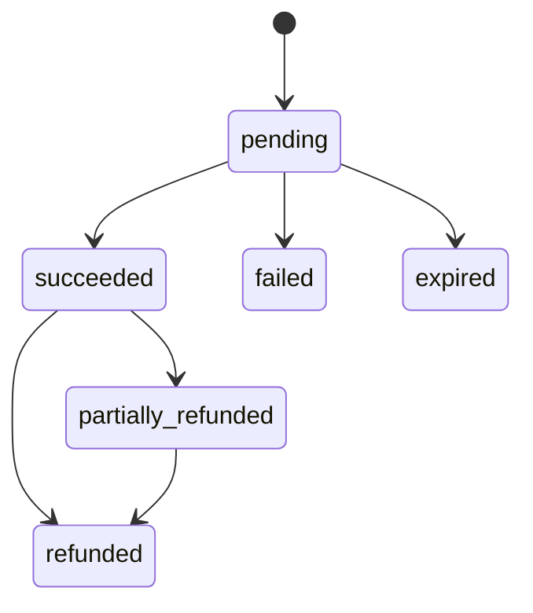

# Fluxos e Máquinas de Estado — Neulander Parking

## 1. Máquina de estado — `ParkingSession`

Invariantes:
- Uma placa só pode ter **uma** sessão não finalizada por estacionamento (unique parcial no banco).
- `rate_plan_version_id` é fixado na entrada.
- Saída só é permitida em `paid` com `now <= exit_deadline_at`, ou em `open` se o valor cotado for 0.

## 2. Entrada e saída pelo operador (caminho principal do MVP)

## 3. Pagamento via app (Pix) com webhook

Falhas tratadas: webhook duplicado (unique em `webhook_events`), webhook fora de ordem (sempre consulta estado no PSP),
webhook perdido (job `payments-reconcile`), valor divergente (rejeita e audita), pagamento após sessão cancelada (estorno automático).

## 4. Máquina de estado — `Reservation` (Fase 8)

Alocação: escolhe vaga `reservable` do tipo pedido; `INSERT` protegido pela exclusion constraint; em `23P01` tenta a próxima candidata (máx. N tentativas) → `409 SPOT_UNAVAILABLE`.

## 5. Máquina de estado — `Payment`

## 6. Mensalista na entrada (Fase 9)

Na `StartSession`, se a placa pertence a `subscription_vehicles` de assinatura `active` no lot e o horário é permitido
pelas regras do plano → sessão criada com `subscription_id` e passa direto para `paid` (valor 0, janela de saída ilimitada).
Se `past_due` → entrada como rotativo + alerta ao operador.
