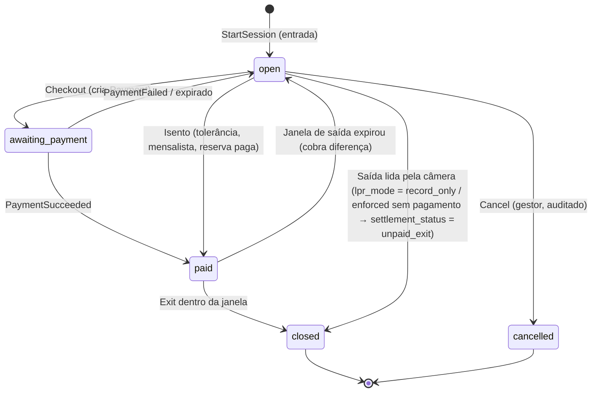
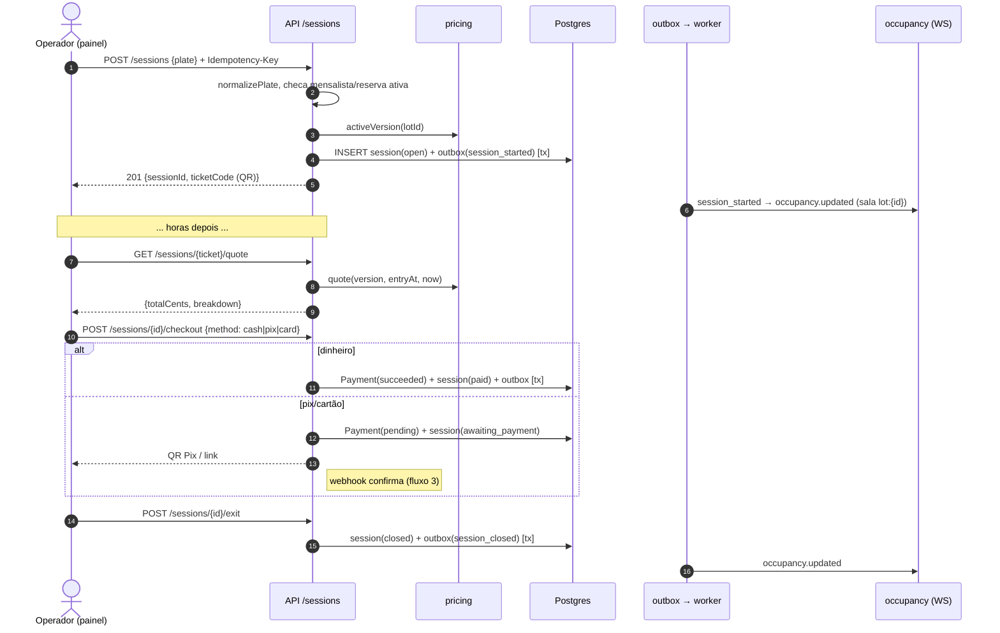
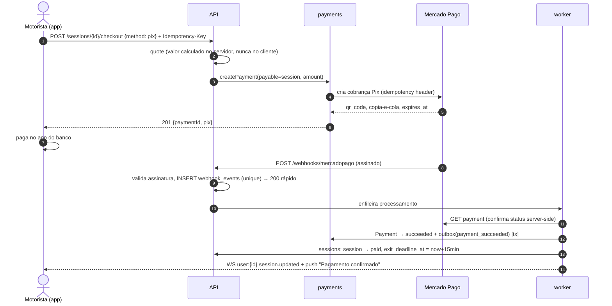
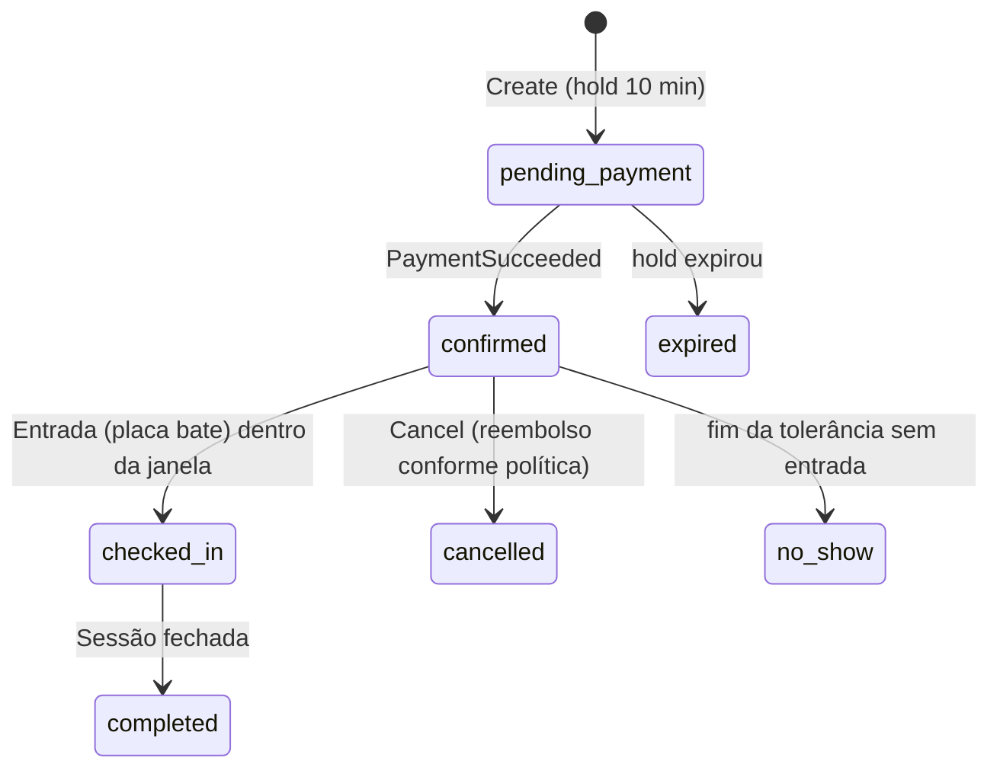
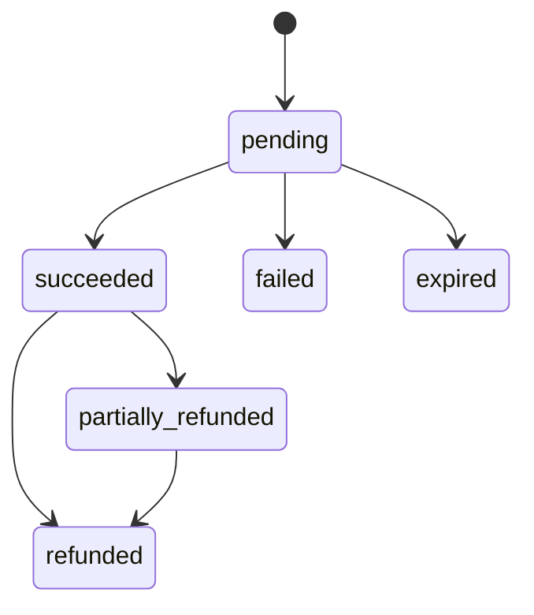
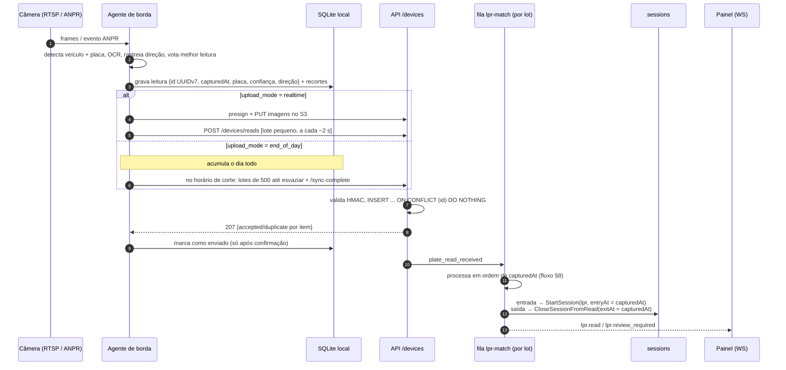
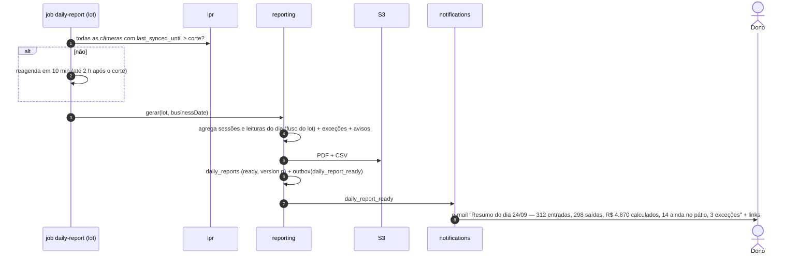

# Fluxos e Máquinas de Estado — Neulander Parking

## 1. Máquina de estado — `ParkingSession`

Invariantes:
- Uma placa só pode ter **uma** sessão não finalizada por estacionamento (unique parcial no banco).
- `rate_plan_version_id` é fixado na entrada.
- Saída pelo operador só é permitida em `paid` com `now <= exit_deadline_at`, ou em `open` se o valor cotado for 0.
- **Saída registrada pela câmera nunca é recusada** (o carro já saiu fisicamente): a sessão fecha com `exit_at = captured_at`,
  `amount_due_cents` calculado e `settlement_status` indicando se foi paga. É isso que alimenta o relatório diário.
- Os horários de entrada/saída de sessões LPR vêm do `captured_at` da leitura, não do relógio do servidor.

## 2. Entrada e saída pelo operador (caminho principal do MVP)

## 3. Pagamento via app (Pix) com webhook

Falhas tratadas: webhook duplicado (unique em `webhook_events`), webhook fora de ordem (sempre consulta estado no PSP),
webhook perdido (job `payments-reconcile`), valor divergente (rejeita e audita), pagamento após sessão cancelada (estorno automático).

## 4. Máquina de estado — `Reservation` (Fase 9)

Alocação: escolhe vaga `reservable` do tipo pedido; `INSERT` protegido pela exclusion constraint; em `23P01` tenta a próxima candidata (máx. N tentativas) → `409 SPOT_UNAVAILABLE`.

## 5. Máquina de estado — `Payment`

## 6. Mensalista na entrada (Fase 10)

Na `StartSession`, se a placa pertence a `subscription_vehicles` de assinatura `active` no lot e o horário é permitido
pelas regras do plano → sessão criada com `subscription_id` e passa direto para `paid` (valor 0, janela de saída ilimitada).
Se `past_due` → entrada como rotativo + alerta ao operador.

## 7. Câmera LPR — do carro na cancela até a sessão

Garantias: **at-least-once** do agente + **idempotência** no servidor = exatamente uma leitura registrada.
Internet caída: o agente continua lendo e grava tudo localmente; ao voltar, envia o atraso em ordem.

## 8. Pareamento de leituras (`PlateMatcher`, domínio puro)

Para cada leitura, em ordem de `captured_at` dentro do estacionamento:

1. **Deduplicação:** mesma placa + mesma direção + mesmo dispositivo em < 60 s → `duplicate`.
2. **Confiança:** abaixo do limiar da câmera (padrão 0,80) → `needs_review` (não mexe em sessão até alguém revisar).
3. **Entrada (`in`):**
   - já existe sessão aberta dessa placa → provável saída não lida; fecha a anterior como exceção `missing_exit` e abre nova.
   - senão → abre sessão (ou vincula a mensalista/reserva, Fases 9–10).
4. **Saída (`out`):**
   - busca sessão aberta pela placa exata; se não houver, tenta variações de caracteres confundíveis
     (O↔0, I↔1, B↔8, S↔5, Z↔2, G↔6, D↔0) e distância de edição ≤ 1 entre as sessões abertas do lot;
   - exatamente um candidato → fecha a sessão; zero ou vários → `needs_review` com os candidatos sugeridos.
5. **Direção `unknown`** (câmera bidirecional sem rastreamento conclusivo): se há sessão aberta da placa → trata como saída; senão → entrada.
6. **Leitura atrasada** (chega depois de leituras posteriores já processadas): reprocessa a partir do `captured_at` dela
   para aquela placa; se o dia já teve relatório, marca o relatório para nova versão.

Revisão humana (`/plate-reads/:id/review`): corrigir a placa re-executa o pareamento para aquela leitura; tudo auditado.

## 9. Fechamento do dia e relatório

Conteúdo do relatório:
- **Resumo:** entradas, saídas, veículos ainda no pátio no corte, pico de ocupação (horário), permanência média e mediana, faturamento calculado vs. recebido (e diferença).
- **Gráfico:** entradas e saídas por hora.
- **Tabela:** placa · entrada · saída · permanência · valor calculado · valor pago · forma de pagamento · origem (câmera/operador).
- **Exceções:** saída sem entrada, entrada sem saída (dias anteriores), leituras corrigidas manualmente, saída sem pagamento (`enforced`), duplicadas suspeitas.
- **Saúde das câmeras:** tempo online, leituras por câmera, % de leituras em revisão, desvio de relógio.
