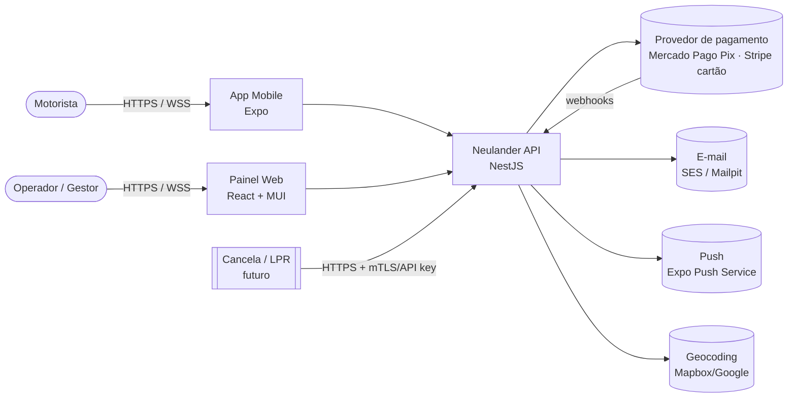
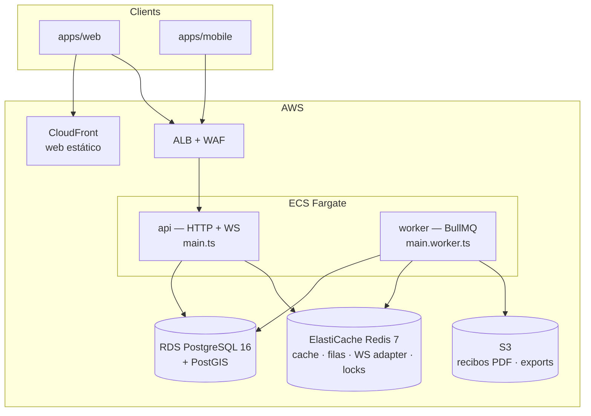

# System Design — Neulander Parking

> Status: v1 (baseline) · Dono: `architect` · Decisões detalhadas em `docs/adr/`

## 1. Visão do produto

Plataforma SaaS multi-tenant para estacionamentos privados (shoppings, prédios comerciais, estacionamentos de rua).

| Persona | Canal | Principais jobs |
|---|---|---|
| **Motorista** (`driver`) | App mobile | Encontrar estacionamento com vaga perto, ver preço, reservar, pagar sem fila, ticket digital (QR), histórico/recibos |
| **Operador** (`operator`) | Painel web (tablet na cancela/guichê) | Registrar entrada/saída por placa ou QR, cobrar, emitir ticket, ver ocupação |
| **Gestor** (`manager`) | Painel web | Cadastrar estacionamento, setores, vagas, tabelas de preço, mensalistas, relatórios de faturamento/ocupação |
| **Admin da plataforma** (`platform_admin`) | Painel web | Onboarding de organizações, suporte, métricas globais |

### Escopo do MVP (Fases 0–7)
Cadastro de estacionamentos/vagas, tabela de preços, entrada/saída pelo operador, cálculo de tarifa,
pagamento (Pix + cartão + dinheiro), ocupação em tempo real, app do motorista com busca no mapa e pagamento de sessão.

### Pós-MVP (Fases 8+)
Reservas antecipadas, mensalistas, relatórios avançados, integração com cancelas (dispositivos), LPR (leitura de placa por câmera), sensores IoT.

## 2. Requisitos não funcionais

| Atributo | Meta |
|---|---|
| Disponibilidade | 99,5% (MVP) — operação de cancela precisa de modo degradado |
| Latência API | p95 < 200 ms leitura, < 400 ms escrita (excluindo provedor de pagamento) |
| Tempo real | Atualização de ocupação no painel/app em < 2 s |
| Consistência | **Forte** para sessões, reservas e pagamentos (Postgres, transações). Eventual para relatórios e contadores de cache |
| Segurança | OWASP ASVS L2, JWT curto + refresh rotativo, RBAC por organização, LGPD |
| Observabilidade | Logs estruturados (pino) com `requestId`, traces OpenTelemetry, métricas RED, Sentry |
| Custo | Rodar em free tier/low-cost para portfólio; escalar horizontalmente sem reescrita |

## 3. Estimativa de capacidade (ordem de grandeza)

Cenário alvo de "sucesso": 500 estacionamentos × 200 vagas = **100 mil vagas**.

- Giro médio 3 veículos/vaga/dia → **300 mil sessões/dia** → ~3,5 escritas/s média, **pico ~40/s** (horário comercial, 10×).
- Cada sessão ≈ 4 escritas (entrada, cálculo, pagamento, saída) → pico **~160 writes/s** — confortável para um único Postgres.
- Buscas no mapa: 50 mil motoristas ativos, 5 buscas/sessão → pico **~300 reads/s** → cache Redis (TTL 5 s) por tile/geohash.
- Storage: sessão ≈ 1 KB → 300 MB/mês + pagamentos/eventos ≈ **< 10 GB/ano**. Particionar `parking_sessions` por mês a partir do 2º ano.
- WebSocket: 1 conexão por painel (≈ 1–3 mil) + motoristas em sessão ativa (≈ 10 mil). Socket.IO com Redis adapter, 2–4 tasks.

**Conclusão:** monólito modular + 1 Postgres primário (+ réplica de leitura depois) atende com folga. Microsserviços seriam custo sem benefício (ADR-0001).

## 4. Arquitetura — Contexto (C4 nível 1)



## 5. Contêineres (C4 nível 2)



- **API e worker são o mesmo código** (`apps/api`), dois entrypoints. Escalam independente.
- **Web** é SPA estática (S3 + CloudFront). **Mobile** distribuído via Expo EAS.

## 6. Componentes — módulos da API (C4 nível 3)

Monólito modular; cada módulo é um *bounded context* com fronteira forçada por lint (`eslint-plugin-boundaries`).

| Módulo | Responsabilidade | Principais agregados | Publica eventos |
|---|---|---|---|
| `identity` | Cadastro, login, JWT/refresh, RBAC, organizações, membros | `User`, `Organization`, `Membership` | `UserRegistered` |
| `facilities` | Estacionamentos, setores (zonas), vagas, horários, geolocalização | `ParkingLot`, `Zone`, `Spot` | `LotPublished`, `SpotStatusChanged` |
| `pricing` | Tabelas de preço versionadas; delega cálculo a `packages/pricing` | `RatePlan` | `RatePlanActivated` |
| `sessions` | Ciclo de vida da permanência (entrada → pagamento → saída), tickets QR | `ParkingSession` | `SessionStarted`, `SessionPaid`, `SessionClosed` |
| `reservations` | Reserva antecipada com janela de tempo e no-show | `Reservation` | `ReservationConfirmed`, `ReservationExpired` |
| `payments` | Intenções de pagamento, adapters PSP, webhooks, estornos, conciliação | `Payment`, `PaymentAttempt` | `PaymentSucceeded`, `PaymentFailed`, `PaymentRefunded` |
| `subscriptions` | Mensalistas: planos, contratos, cobrança recorrente, placas autorizadas | `SubscriptionPlan`, `Subscription` | `SubscriptionActivated`, `SubscriptionPastDue` |
| `occupancy` | Contadores em tempo real, gateway WebSocket, cache de disponibilidade | (read model) | — consome eventos |
| `notifications` | E-mail, push, templates | `Notification` | — consome eventos |
| `reporting` | Read models de faturamento/ocupação, exports CSV/PDF | (projeções) | — consome eventos |
| `devices` *(pós-MVP)* | Cancelas, câmeras LPR, sensores; autenticação por API key/mTLS | `GateDevice` | `PlateRead` |
| `shared` (kernel) | `DomainError`, `Clock`, `Money/Cents`, outbox, idempotência, auditoria | — | — |

### Estrutura interna de um módulo

```
apps/api/src/modules/sessions/
  index.ts                 # API pública do módulo (único import permitido de fora)
  sessions.module.ts
  domain/                  # puro: entidades, value objects, máquina de estado, erros
  application/             # casos de uso (StartSession, QuoteSession, CloseSession)
  infra/                   # repositórios Drizzle, schema das tabelas do módulo
  http/                    # controllers, guards específicos
  events/                  # handlers de eventos consumidos
```

### Comunicação entre módulos
- **Síncrona** (consulta necessária na mesma transação): via serviço exportado no `index.ts` (ex.: `sessions` chama `pricing.quote()`).
- **Assíncrona** (efeitos colaterais): evento gravado em `outbox_events` na mesma transação → relay publica em BullMQ → handlers idempotentes (ADR-0007).

## 7. Decisões-chave de design

### 7.1 Motor de tarifação (`packages/pricing`)
Função pura `quote(ratePlan, entryAt, exitAt, context) → { totalCents, breakdown[] }`. Regras suportadas:
tolerância (grace), primeira fração, frações adicionais, teto diário, pernoite, tarifa por dia da semana/horário,
desconto de convênio, perda de ticket. Regras são **versionadas**: a sessão grava `rate_plan_version_id` na entrada,
então mudança de preço nunca afeta quem já entrou. Compartilhado com o mobile para estimativa offline.

### 7.2 Concorrência em reservas
Reserva aloca uma vaga concreta numa janela `tstzrange`. Double-booking é impedido **pelo banco**:
`EXCLUDE USING gist (spot_id WITH =, period WITH &&) WHERE status IN ('pending_payment','confirmed','checked_in')`
(ADR-0010). A aplicação escolhe a vaga candidata e trata `23P01` (exclusion violation) tentando a próxima.

### 7.3 Contagem de ocupação
Fonte da verdade: `spots.status` + sessões abertas no Postgres. Read model: hash Redis `occupancy:{lotId}` atualizado
por eventos (`SessionStarted/Closed`, `SpotStatusChanged`) e reconciliado a cada 5 min por job. Broadcast via
Socket.IO na sala `lot:{lotId}`. Busca no mapa lê do Redis; fallback para Postgres.

### 7.4 Busca geográfica
`parking_lots.location geography(Point,4326)` com índice GiST. Query `ST_DWithin` + ordenação por distância,
paginação por cursor. Cache de resultado por geohash de precisão 6 (~1,2 km) com TTL 5 s para disponibilidade.

### 7.5 Pagamentos
Porta `PaymentProvider` com adapters `MercadoPagoPixProvider`, `StripeCardProvider`, `CashProvider` (operador) e
`FakeProvider` (dev/testes). Fluxo: cria `Payment(pending)` com `idempotency_key` → PSP → webhook assinado confirma
→ `PaymentSucceeded` → `sessions` marca sessão paga e abre **janela de saída** (padrão 15 min). Nunca confiar no
retorno do cliente; somente webhook/consulta server-side muda status (ADR-0005).

### 7.6 Modo degradado da cancela
Se a API estiver indisponível, o painel do operador mantém fila local (IndexedDB) de entradas/saídas com
`Idempotency-Key` gerado no cliente e sincroniza ao reconectar. Conflitos resolvidos pelo servidor. (Fase 10.)

## 8. Segurança

- **Auth:** access token JWT (15 min, RS256) + refresh token opaco rotativo (30 dias, hash no banco, detecção de reuso). Senha com argon2id. Mobile guarda refresh em SecureStore; web em cookie `HttpOnly; Secure; SameSite=Strict` (ADR-0004).
- **RBAC:** papéis por organização (`owner`, `manager`, `operator`) + `driver` global + `platform_admin`. Guard `@Roles()` + escopo por `organization_id` e, para operador, por `parking_lot_id`.
- **Webhooks:** validação de assinatura HMAC, allowlist de IP quando o PSP oferecer, tabela `webhook_events` com unique no ID externo.
- **Rate limiting:** Redis (`@nestjs/throttler`) por IP e por usuário; mais restrito em login e criação de pagamento.
- **LGPD:** mínimo de dados, consentimento no cadastro do motorista, export/exclusão de conta, retenção (sessões anonimizadas após 5 anos por obrigação fiscal; logs 30 dias), placas mascaradas em logs.
- **Auditoria:** `audit_logs` para ações sensíveis (estorno, cancelamento manual de cobrança, alteração de tarifa, abertura manual de cancela).
- **Supply chain:** Renovate/Dependabot, `pnpm audit` no CI, imagem distroless, scan com Trivy.

## 9. Observabilidade

- `nestjs-pino` com `requestId`/`traceId` propagados; placas/CPF redigidos.
- OpenTelemetry SDK → OTLP (Grafana Cloud free tier ou AWS X-Ray).
- Métricas de negócio: sessões abertas, receita/h, taxa de falha de pagamento, latência do webhook, no-show.
- Health checks: `/health/live`, `/health/ready` (db, redis).
- Sentry em api, web e mobile.

## 10. Estratégia de testes

| Nível | Ferramenta | Alvo |
|---|---|---|
| Unitário | Vitest | `domain/`, `packages/pricing`, utilitários (≥ 90%) |
| Integração | Vitest + Supertest + Testcontainers (Postgres/PostGIS, Redis) | Casos de uso e controllers, banco real |
| Contrato | Schemas Zod compartilhados + teste de snapshot do OpenAPI | Quebra de contrato entre API e clientes |
| Componente | React Testing Library + MSW | Telas do painel |
| E2E web | Playwright | Entrada → cobrança → saída; login; cadastro de tarifa |
| E2E mobile | Maestro (opcional) | Busca → pagamento de sessão |
| Carga | k6 | Pico de 40 sessões/s e 300 buscas/s (Fase 10) |

## 11. Deploy e ambientes

| Ambiente | Onde | Como |
|---|---|---|
| `local` | Docker Compose (postgres+postgis, redis, mailpit) | `pnpm dev` |
| `preview` | Opcional — Render/Fly.io para demo de portfólio | Deploy por PR |
| `staging` / `prod` | AWS: ECS Fargate, RDS, ElastiCache, S3+CloudFront, Secrets Manager | Terraform + GitHub Actions (OIDC, sem chaves estáticas) |

Pipeline: `lint → typecheck → unit → integration → build → docker image (ECR) → migrate (task one-off) → deploy rolling`.

## 12. Riscos e mitigação

| Risco | Mitigação |
|---|---|
| Regras de tarifa variam muito entre estacionamentos | Motor baseado em regras compostas + testes de propriedade (fast-check) |
| Webhook de pagamento atrasado/perdido | Job de conciliação consulta PSP para `pending` > 2 min |
| Operador sem internet | Modo degradado com fila local (7.6) |
| Placa digitada errado | Normalização + busca fuzzy (trigram) + confirmação por QR |
| Escopo grande demais para portfólio | Fases entregáveis independentes; MVP demonstrável ao fim da Fase 7 |
