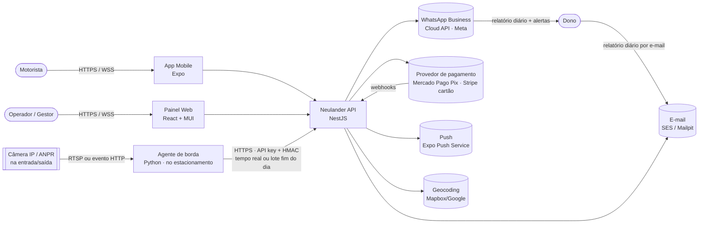
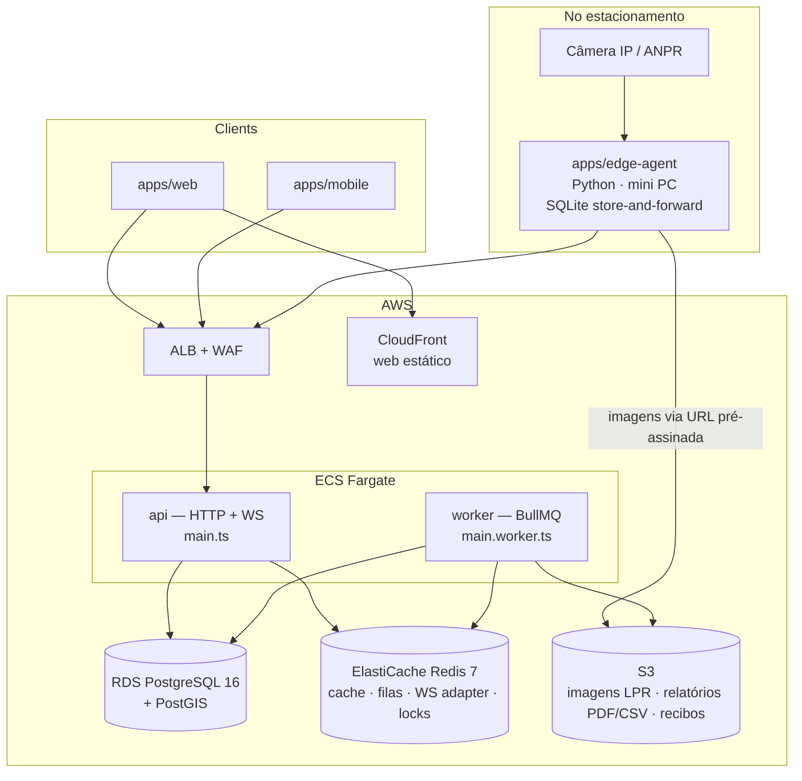
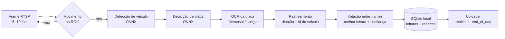

# System Design — Neulander Parking

> Status: v1 (baseline) · Dono: `architect` · Decisões detalhadas em `docs/adr/`

## 1. Visão do produto

Plataforma SaaS multi-tenant para estacionamentos privados (shoppings, prédios comerciais, estacionamentos de rua).

| Persona | Canal | Principais jobs |
|---|---|---|
| **Motorista** (`driver`) | App mobile | Encontrar estacionamento com vaga perto, ver preço, reservar, pagar sem fila, ticket digital (QR), histórico/recibos |
| **Operador** (`operator`) | Painel web (tablet na cancela/guichê) | Registrar entrada/saída por placa ou QR, cobrar, emitir ticket, ver ocupação |
| **Gestor** (`manager`) | Painel web | Cadastrar estacionamento, setores, vagas, tabelas de preço, mensalistas, relatórios de faturamento/ocupação |
| **Dono do estacionamento** (`owner`) | E-mail + painel web | Receber o **relatório diário** automático (entradas/saídas por placa, permanência, faturamento estimado, exceções) sem precisar estar no local |
| **Admin da plataforma** (`platform_admin`) | Painel web | Onboarding de organizações, suporte, métricas globais |
| **Câmera + agente de borda** (dispositivo) | HTTPS (API de dispositivo) | Ler a placa de cada veículo na entrada/saída e enviar a leitura com horário, em tempo real ou em lote no fim do dia |

### Escopo do MVP (Fases 0–8)
Cadastro de estacionamentos/vagas, tabela de preços, entrada/saída pelo operador, **controle automático de
entrada/saída por câmera com leitura de placa (LPR) e relatório diário para o dono**, cálculo de tarifa,
pagamento (Pix + cartão + dinheiro), ocupação em tempo real, app do motorista com busca no mapa e pagamento de sessão.

### Pós-MVP (Fases 9+)
Reservas antecipadas, mensalistas, relatórios de período, abertura automática de cancela, sensores IoT.

## 2. Requisitos não funcionais

| Atributo | Meta |
|---|---|
| Disponibilidade | 99,5% (MVP) — operação de cancela precisa de modo degradado |
| Latência API | p95 < 200 ms leitura, < 400 ms escrita (excluindo provedor de pagamento) |
| Tempo real | Atualização de ocupação no painel/app em < 2 s |
| LPR | Leitura → registro no servidor em < 3 s (modo `realtime`); acurácia por placa ≥ 95% de dia / ≥ 90% à noite; **zero perda de leitura** com a internet caída (store-and-forward) |
| Relatório diário | Entregue até 2 h após o horário de corte do estacionamento, mesmo se uma câmera estiver offline (com aviso) |
| Consistência | **Forte** para sessões, reservas e pagamentos (Postgres, transações). Eventual para relatórios e contadores de cache |
| Segurança | OWASP ASVS L2, JWT curto + refresh rotativo, RBAC por organização, LGPD |
| Observabilidade | Logs estruturados (pino) com `requestId`, traces OpenTelemetry, métricas RED, Sentry |
| Custo | Rodar em free tier/low-cost para portfólio; escalar horizontalmente sem reescrita |

## 3. Estimativa de capacidade (ordem de grandeza)

Cenário alvo de "sucesso": 500 estacionamentos × 200 vagas = **100 mil vagas**.

- Giro médio 3 veículos/vaga/dia → **300 mil sessões/dia** → ~3,5 escritas/s média, **pico ~40/s** (horário comercial, 10×).
- Cada sessão ≈ 4 escritas (entrada, cálculo, pagamento, saída) → pico **~160 writes/s** — confortável para um único Postgres.
- Buscas no mapa: 50 mil motoristas ativos, 5 buscas/sessão → pico **~300 reads/s** → cache Redis (TTL 5 s) por tile/geohash.
- Storage: sessão ≈ 1 KB → 300 MB/mês + pagamentos/eventos ≈ **< 10 GB/ano**. Particionar `parking_sessions` por mês a partir do 2º ano.
- WebSocket: 1 conexão por painel (≈ 1–3 mil) + motoristas em sessão ativa (≈ 10 mil). Socket.IO com Redis adapter, 2–4 tasks.

- LPR: ~600 passagens/dia/estacionamento (entradas + saídas) × 500 = **300 mil leituras/dia**. Lote de fim do dia:
  500 estacionamentos enviando juntos ≈ 600 leituras cada → ingestão em lotes de 500 com fila, tranquilo.
- Imagens LPR: 2 recortes (placa + veículo) ≈ 60 KB por leitura → **~18 GB/dia**; retenção de 30 dias ≈ 540 GB no S3
  com lifecycle (expurgo automático). Sem vídeo contínuo no servidor.

**Conclusão:** monólito modular + 1 Postgres primário (+ réplica de leitura depois) atende com folga. Microsserviços seriam custo sem benefício (ADR-0001).

## 4. Arquitetura — Contexto (C4 nível 1)



## 5. Contêineres (C4 nível 2)



- **API e worker são o mesmo código** (`apps/api`), dois entrypoints. Escalam independente.
- **Agente de borda** (`apps/edge-agent`) roda num mini PC no estacionamento, ao lado da câmera. É o único componente
  em Python (ecossistema de visão computacional) e fala com a API só por HTTPS, com contratos gerados dos schemas Zod (ADR-0011).
- **Web** é SPA estática (S3 + CloudFront). **Mobile** distribuído via Expo EAS.

## 6. Componentes — módulos da API (C4 nível 3)

Monólito modular; cada módulo é um *bounded context* com fronteira forçada por lint (`eslint-plugin-boundaries`).

| Módulo | Responsabilidade | Principais agregados | Publica eventos |
|---|---|---|---|
| `identity` | Cadastro, login, JWT/refresh, RBAC, organizações, membros | `User`, `Organization`, `Membership` | `UserRegistered` |
| `facilities` | Estacionamentos, setores (zonas), vagas, horários, geolocalização | `ParkingLot`, `Zone`, `Spot` | `LotPublished`, `SpotStatusChanged` |
| `pricing` | Tabelas de preço versionadas; delega cálculo a `packages/pricing` | `RatePlan` | `RatePlanActivated` |
| `sessions` | Ciclo de vida da permanência (entrada → pagamento → saída), tickets QR | `ParkingSession` | `SessionStarted`, `SessionPaid`, `SessionClosed` |
| `reservations` | Reserva antecipada com janela de tempo e no-show | `Reservation` | `ReservationConfirmed`, `ReservationExpired` |
| `payments` | Intenções de pagamento, adapters PSP, webhooks, estornos, conciliação | `Payment`, `PaymentAttempt` | `PaymentSucceeded`, `PaymentFailed`, `PaymentRefunded` |
| `subscriptions` | Mensalistas: planos, contratos, cobrança recorrente, placas autorizadas | `SubscriptionPlan`, `Subscription` | `SubscriptionActivated`, `SubscriptionPastDue` |
| `lpr` | Câmeras/agentes de borda (cadastro, chave, heartbeat, config), ingestão de leituras, pareamento entrada↔saída, fila de revisão | `Device`, `PlateRead` | `PlateReadReceived`, `PlateReadMatched`, `ReviewRequired`, `DeviceOffline` |
| `occupancy` | Contadores em tempo real, gateway WebSocket, cache de disponibilidade | (read model) | — consome eventos |
| `notifications` | E-mail (SES), WhatsApp (Cloud API da Meta, ADR-0013), push, templates, opt-in e status de entrega | `Notification`, `ReportRecipient` | — consome eventos |
| `reporting` | **Relatório diário por estacionamento** (fechamento, PDF/CSV, envio por e-mail e WhatsApp), read models de faturamento/ocupação, exports | `DailyReport` + projeções | `DailyReportReady` |
| `shared` (kernel) | `DomainError`, `Clock`, `Money/Cents`, outbox, idempotência, auditoria | — | — |

### Estrutura interna de um módulo

```
apps/api/src/modules/sessions/
  index.ts                 # API pública do módulo (único import permitido de fora)
  sessions.module.ts
  domain/                  # puro: entidades, value objects, máquina de estado, erros
  application/             # casos de uso (StartSession, QuoteSession, CloseSession)
  infra/                   # repositórios Drizzle, schema das tabelas do módulo
  http/                    # controllers, guards específicos
  events/                  # handlers de eventos consumidos
```

### Comunicação entre módulos
- **Síncrona** (consulta necessária na mesma transação): via serviço exportado no `index.ts` (ex.: `sessions` chama `pricing.quote()`).
- **Assíncrona** (efeitos colaterais): evento gravado em `outbox_events` na mesma transação → relay publica em BullMQ → handlers idempotentes (ADR-0007).

## 7. Decisões-chave de design

### 7.1 Motor de tarifação (`packages/pricing`)
Função pura `quote(ratePlan, entryAt, exitAt, context) → { totalCents, breakdown[] }`. Regras suportadas:
tolerância (grace), primeira fração, frações adicionais, teto diário, pernoite, tarifa por dia da semana/horário,
desconto de convênio, perda de ticket. Regras são **versionadas**: a sessão grava `rate_plan_version_id` na entrada,
então mudança de preço nunca afeta quem já entrou. Compartilhado com o mobile para estimativa offline.

### 7.2 Concorrência em reservas
Reserva aloca uma vaga concreta numa janela `tstzrange`. Double-booking é impedido **pelo banco**:
`EXCLUDE USING gist (spot_id WITH =, period WITH &&) WHERE status IN ('pending_payment','confirmed','checked_in')`
(ADR-0010). A aplicação escolhe a vaga candidata e trata `23P01` (exclusion violation) tentando a próxima.

### 7.3 Contagem de ocupação
Fonte da verdade: `spots.status` + sessões abertas no Postgres. Read model: hash Redis `occupancy:{lotId}` atualizado
por eventos (`SessionStarted/Closed`, `SpotStatusChanged`) e reconciliado a cada 5 min por job. Broadcast via
Socket.IO na sala `lot:{lotId}`. Busca no mapa lê do Redis; fallback para Postgres.

### 7.4 Busca geográfica
`parking_lots.location geography(Point,4326)` com índice GiST. Query `ST_DWithin` + ordenação por distância,
paginação por cursor. Cache de resultado por geohash de precisão 6 (~1,2 km) com TTL 5 s para disponibilidade.

### 7.5 Pagamentos
Porta `PaymentProvider` com adapters `MercadoPagoPixProvider`, `StripeCardProvider`, `CashProvider` (operador) e
`FakeProvider` (dev/testes). Fluxo: cria `Payment(pending)` com `idempotency_key` → PSP → webhook assinado confirma
→ `PaymentSucceeded` → `sessions` marca sessão paga e abre **janela de saída** (padrão 15 min). Nunca confiar no
retorno do cliente; somente webhook/consulta server-side muda status (ADR-0005).

### 7.6 Modo degradado da cancela
Se a API estiver indisponível, o painel do operador mantém fila local (IndexedDB) de entradas/saídas com
`Idempotency-Key` gerado no cliente e sincroniza ao reconectar. Conflitos resolvidos pelo servidor. (Fase 11.)

### 7.7 Câmera LPR e agente de borda

**Por que um agente de borda e não mandar vídeo para a nuvem?** Vídeo contínuo custa banda e dinheiro, e cai junto com a
internet do estacionamento. O agente processa localmente e envia só **leituras** (placa, horário, direção, confiança) +
2 recortes JPEG. Com a internet caída, nada se perde: tudo fica no SQLite local até sincronizar (ADR-0011).

**Fontes de imagem suportadas (adapters):**
1. **Câmera com LPR embarcado (ANPR)** — ex.: Intelbras, Hikvision. A câmera já reconhece a placa e manda evento HTTP ao
   agente; o agente só normaliza e encaminha. Caminho mais confiável para produção.
2. **Câmera IP comum (RTSP)** — o agente roda o pipeline próprio de reconhecimento (abaixo). Mais barato, é o que torna o projeto interessante no portfólio.
3. **Simulador** — lê pasta de imagens ou arquivo de vídeo com horários sintéticos. Permite desenvolver, testar e fazer demo sem câmera física.

**Pipeline (fonte RTSP):**


- **Direção — configuração padrão é UMA câmera para entrada e saída** (`lane = bidirectional`). A câmera fica de frente
  para quem entra: carros entrando mostram a placa dianteira; saindo, a traseira. A direção é decidida em camadas:
  1. evento da câmera ANPR, se o modelo informar sentido (aproximando/afastando);
  2. rastreamento do agente no stream RTSP da própria câmera (sentido do movimento cruzando uma linha virtual e variação do
     tamanho da placa: crescendo = aproximando = entrada) — funciona tanto na fonte `rtsp` quanto em paralelo à `anpr_push`;
  3. se ainda for inconclusiva → `direction = unknown` e o servidor decide pelo estado (tem sessão aberta → saída; senão → entrada).
  Faixas separadas (`lane = entry`/`exit`) continuam suportadas para estacionamentos com duas câmeras.
- **Motos** só têm placa traseira: com câmera única voltada para quem entra, a entrada da moto não é lida. A saída sem
  entrada de `vehicle_type = motorcycle` vira exceção **esperada** no relatório (não vai para a fila de revisão) e o operador
  pode lançar a entrada da moto no painel. Solução definitiva: segunda câmera (ver `docs/hardware/equipamentos-e-custos.md`).
- **Horário:** vale o `captured_at` do agente (relógio sincronizado por NTP), nunca o horário em que o servidor recebeu.
  O heartbeat reporta o desvio do relógio; desvio > 30 s gera alerta.
- **Modos de envio (por câmera):** `realtime` (envia em segundos, painel ao vivo) ou `end_of_day` (acumula e envia em lote
  no horário de corte, para locais com internet ruim ou para economizar dados). Em ambos o agente reenvia até receber confirmação;
  a ingestão é idempotente pelo `id` da leitura gerado na borda (ADR-0012).

**Pareamento no servidor (`lpr` → `sessions`):** as leituras são processadas **em ordem de `captured_at` por estacionamento**,
o que torna o resultado igual em tempo real ou em lote. Entrada abre sessão (`entry_channel = lpr`); saída procura a sessão
aberta da mesma placa (exato → variações de caracteres confundíveis O/0, I/1, B/8…). Leituras com confiança baixa ou sem par vão
para a **fila de revisão** no painel. Detalhes em `flows.md` §7–8.

**Modos de operação do estacionamento (`parking_lots.lpr_mode`):**
| Modo | Uso |
|---|---|
| `off` | Só operador manual |
| `record_only` | Câmera **registra** entrada/saída e calcula o valor devido; cobrança continua com o operador. Ideal para o dono auditar o movimento real vs. o que foi cobrado |
| `enforced` | Saída só é considerada regular se a sessão estiver paga; saída sem pagamento vira exceção no relatório (e, com cancela na Fase 12, bloqueia a saída) |

**Hardware e custos:** ver `docs/hardware/equipamentos-e-custos.md` (kit por estacionamento com 3 referências de preço por item).
**Hardware alvo (plano econômico):** câmera comum com RTSP (TP-Link Tapo C320WS, ~R$ 330) + agente rodando no **PC do guichê**
como serviço do Windows (ADR-0014), sem mini PC dedicado. Câmeras LPR dedicadas ficam como upgrade quando a acurácia medida não bastar.
**Hardware de referência (dedicado):** mini PC x86 (Intel N100, 16 GB) roda 1–2 câmeras RTSP a 5 fps com modelos ONNX em CPU;
para mais câmeras, Jetson Orin Nano. Câmera com lente adequada à faixa, iluminação IR para a noite, altura/ângulo conforme guia em `apps/edge-agent/README.md`.

### 7.8 Relatório diário para o dono

Job `daily-report` por estacionamento no **horário de corte** (`business_day_cutoff`, ex.: 23:59 no fuso do lot):
1. Aguarda todas as câmeras do lot sincronizarem até o corte (`devices.last_synced_until ≥ corte`), no máximo 2 h.
   Se alguma não sincronizar, gera assim mesmo e marca o aviso "câmera X sem dados desde HH:MM".
2. Agrega: total de entradas/saídas, veículos por hora, pico de ocupação, permanência média/mediana, lista completa
   (placa, entrada, saída, permanência, valor calculado, valor efetivamente pago), **veículos ainda dentro**, faturamento
   calculado vs. recebido, e **exceções** (saída sem entrada, leitura corrigida manualmente, saída sem pagamento em `enforced`,
   câmera offline).
3. Gera PDF + CSV no S3, grava `daily_reports` e envia para cada destinatário ativo em `report_recipients` (dono e gestores):
   - **E-mail:** resumo no corpo + PDF anexo + link assinado para o CSV.
   - **WhatsApp:** mensagem de template aprovado pela Meta (categoria *utility*) com o **PDF como documento** e o resumo
     no texto (entradas, saídas, no pátio, faturamento, nº de exceções). Exige opt-in registrado do destinatário.
   - Falha em um canal não bloqueia o outro; status de entrega (enviado/entregue/lido/falhou) vem por webhook e aparece no painel.
   - Mesmo canal serve para **alertas** opcionais: câmera offline > 15 min, fila de revisão acumulada, relatório com aviso.
4. Leitura atrasada que muda um dia já fechado → relatório marcado como "revisado" e reenviado (versão 2).

Disponível também no painel (página "Relatórios diários") e, durante o dia, em tempo real no feed de leituras e no dashboard.

## 8. Segurança

- **Auth:** access token JWT (15 min, RS256) + refresh token opaco rotativo (30 dias, hash no banco, detecção de reuso). Senha com argon2id. Mobile guarda refresh em SecureStore; web em cookie `HttpOnly; Secure; SameSite=Strict` (ADR-0004).
- **RBAC:** papéis por organização (`owner`, `manager`, `operator`) + `driver` global + `platform_admin`. Guard `@Roles()` + escopo por `organization_id` e, para operador, por `parking_lot_id`.
- **Dispositivos (agente de borda):** API key por dispositivo (hash no banco, exibida uma vez, rotacionável) + assinatura HMAC
  do corpo com timestamp (janela de 5 min contra replay); escopo restrito a um estacionamento; só endpoints `/v1/devices/*`.
  O endereço RTSP e a senha da câmera ficam só no agente, nunca no servidor.
- **WhatsApp:** só a API oficial (Cloud API da Meta) — bibliotecas não oficiais violam os termos e o número pode ser banido.
  Token de sistema no Secrets Manager; webhook validado por `X-Hub-Signature-256`; telefone do destinatário é dado pessoal (mascarado em logs).
- **Webhooks:** validação de assinatura HMAC, allowlist de IP quando o PSP oferecer, tabela `webhook_events` com unique no ID externo.
- **Rate limiting:** Redis (`@nestjs/throttler`) por IP e por usuário; mais restrito em login e criação de pagamento.
- **LGPD — câmeras:** placa e imagem de veículo são dados pessoais. Aviso visível de monitoramento na entrada; só recortes
  (sem vídeo contínuo); retenção de imagens configurável (padrão 30 dias) com expurgo automático; bucket criptografado e privado,
  acesso por URL assinada de curta duração e registrado em `audit_logs`; leituras em si mantidas pelo prazo fiscal.
- **LGPD:** mínimo de dados, consentimento no cadastro do motorista, export/exclusão de conta, retenção (sessões anonimizadas após 5 anos por obrigação fiscal; logs 30 dias), placas mascaradas em logs.
- **Auditoria:** `audit_logs` para ações sensíveis (estorno, cancelamento manual de cobrança, alteração de tarifa, abertura manual de cancela).
- **Supply chain:** Renovate/Dependabot, `pnpm audit` no CI, imagem distroless, scan com Trivy.

## 9. Observabilidade

- `nestjs-pino` com `requestId`/`traceId` propagados; placas/CPF redigidos.
- OpenTelemetry SDK → OTLP (Grafana Cloud free tier ou AWS X-Ray).
- Métricas de negócio: sessões abertas, receita/h, taxa de falha de pagamento, latência do webhook, no-show.
- Health checks: `/health/live`, `/health/ready` (db, redis).
- Sentry em api, web e mobile.

## 10. Estratégia de testes

| Nível | Ferramenta | Alvo |
|---|---|---|
| Unitário | Vitest | `domain/`, `packages/pricing`, utilitários (≥ 90%) |
| Integração | Vitest + Supertest + Testcontainers (Postgres/PostGIS, Redis) | Casos de uso e controllers, banco real |
| Contrato | Schemas Zod compartilhados + teste de snapshot do OpenAPI | Quebra de contrato entre API e clientes |
| Componente | React Testing Library + MSW | Telas do painel |
| E2E web | Playwright | Entrada → cobrança → saída; login; cadastro de tarifa |
| E2E mobile | Maestro (opcional) | Busca → pagamento de sessão |
| Carga | k6 | Pico de 40 sessões/s, 300 buscas/s e lotes LPR de fim do dia (Fase 11) |
| LPR (borda) | pytest + dataset de avaliação | Acurácia por placa, latência por frame, store-and-forward sem perda (derrubar rede no meio do envio) |

## 11. Deploy e ambientes

| Ambiente | Onde | Como |
|---|---|---|
| `local` | Docker Compose (postgres+postgis, redis, mailpit) | `pnpm dev` |
| `preview` | Opcional — Render/Fly.io para demo de portfólio | Deploy por PR |
| `edge` | Mini PC no estacionamento | Imagem Docker do agente (arm64/amd64) ou serviço systemd; atualização via pull da imagem versionada |
| `staging` / `prod` | AWS: ECS Fargate, RDS, ElastiCache, S3+CloudFront, Secrets Manager | Terraform + GitHub Actions (OIDC, sem chaves estáticas) |

Pipeline: `lint → typecheck → unit → integration → build → docker image (ECR) → migrate (task one-off) → deploy rolling`.

## 12. Riscos e mitigação

| Risco | Mitigação |
|---|---|
| Regras de tarifa variam muito entre estacionamentos | Motor baseado em regras compostas + testes de propriedade (fast-check) |
| Webhook de pagamento atrasado/perdido | Job de conciliação consulta PSP para `pending` > 2 min |
| Operador sem internet | Modo degradado com fila local (7.6) |
| Placa digitada errado | Normalização + busca fuzzy (trigram) + confirmação por QR |
| Escopo grande demais para portfólio | Fases entregáveis independentes; MVP demonstrável ao fim da Fase 8; valor para o dono já no fim da Fase 5 |
| Leitura de placa errada (sujeira, noite, ângulo) | Votação entre frames, caracteres confundíveis no pareamento, fila de revisão humana, métricas de acurácia por câmera |
| Internet do estacionamento cai | Store-and-forward no agente + modo `end_of_day`; relatório aguarda sincronização |
| Sem câmera física para desenvolver | Fonte "simulador" no agente com imagens/vídeos de exemplo |
